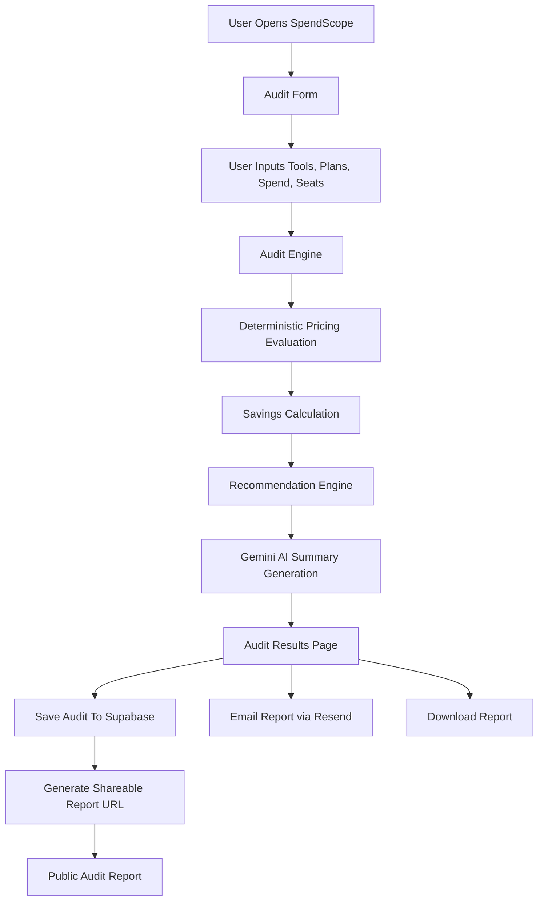

# ARCHITECTURE

---

# System Overview

SpendScope is a full-stack AI spend optimization platform built using Next.js, Supabase, Gemini API, and Resend.

The application allows users to:
- input their AI tooling stack
- analyze current AI subscription spend
- compare usage against pricing benchmarks
- receive optimization recommendations
- generate shareable reports
- receive downloadable/email-delivered audit summaries

The system uses:
- deterministic pricing logic for audit calculations
- AI-generated executive summaries for personalization

This architecture was intentionally designed to keep pricing calculations transparent, explainable, and financially defensible.

---

# System Diagram

---

# Data Flow

## 1. User Input

The user fills out:
- AI tools used
- selected plans
- monthly spend
- seat counts
- company/team information
- primary use case

This data is managed through React state inside the Next.js frontend.

---

## 2. Audit Engine Processing

The frontend sends structured audit data into the deterministic audit engine.

The audit engine:
- compares spend against pricing benchmarks
- evaluates seat efficiency
- checks for plan mismatches
- estimates optimization opportunities
- calculates monthly and annual savings

The audit engine intentionally avoids using AI for pricing math to ensure:
- transparency
- consistency
- predictable outputs
- defensible recommendations

---

## 3. AI Summary Generation

After deterministic calculations finish:
- audit results are sent to the Gemini API
- Gemini generates a concise executive summary paragraph

AI is only used for:
- narrative generation
- human-readable summaries

AI is NOT used for:
- savings calculations
- pricing logic
- benchmark evaluation

Fallback summaries are generated automatically if the API fails.

---

## 4. Result Generation

The results page renders:
- executive summary
- optimization opportunities
- recommendation cards
- savings estimates
- benchmark reasoning

The report can then be:
- shared publicly
- emailed
- downloaded

---

## 5. Persistence Layer

Audit reports are stored inside Supabase.

Stored data includes:
- audit inputs
- generated results
- AI summaries
- share IDs
- timestamps

Each audit receives a unique public share ID.

---

## 6. Public Sharing

Users can generate:
`/audit/[share_id]`

This creates a publicly accessible read-only audit report.

The share page fetches audit data directly from Supabase using the share ID.

---

# Why I Chose This Stack

## Next.js

Chosen because:
- fast full-stack development
- App Router support
- server/client rendering flexibility
- easy API route integration
- excellent deployment experience with Vercel

---

## TypeScript

Used for:
- type safety
- maintainability
- predictable audit engine behavior
- cleaner data structures

---

## Tailwind CSS

Chosen because:
- rapid UI development
- responsive design support
- easy component styling
- modern SaaS-style UI implementation

---

## Supabase

Chosen because:
- fast backend setup
- PostgreSQL support
- easy persistence layer
- simple API integration
- ideal for MVP development speed

---

## Gemini API

Used only for:
- executive summary generation

Chosen because:
- generous free tier
- fast response times
- strong summary generation quality
- easy integration

---

## Resend

Chosen for:
- transactional email delivery
- developer-friendly API
- fast Next.js integration
- modern email workflow support

---

# Scaling Considerations (10k Audits/Day)

If SpendScope needed to support 10,000 audits/day, I would make the following architectural improvements:

---

## 1. Move Audit Processing To Background Jobs

Currently:
- audits are processed synchronously

At scale:
- move processing to queue workers
- use background job systems

Examples:
- BullMQ
- Trigger.dev
- Cloud Tasks

This prevents blocking user requests.

---

## 2. Cache Pricing Data

Pricing benchmarks are currently loaded statically.

At scale:
- pricing data should be cached centrally
- refresh pricing periodically
- avoid recomputing vendor pricing repeatedly

---

## 3. Rate Limit AI Requests

Gemini summary generation would become expensive at scale.

Solutions:
- caching repeated summaries
- batching requests
- limiting regeneration frequency
- queue-based processing

---

## 4. Add Dedicated API Layer

Currently:
- Next.js handles frontend + backend

At scale:
- move audit logic into dedicated backend services
- separate compute from frontend rendering

Possible stack:
- Node.js services
- FastAPI
- serverless workers

---

## 5. Improve Database Indexing

For large audit volumes:
- index share IDs
- optimize query paths
- archive older reports
- partition large tables

---

## 6. Add Monitoring & Observability

Production-scale infrastructure would require:
- logging
- tracing
- analytics
- error monitoring

Examples:
- Sentry
- PostHog
- Datadog

---

# Final Notes

SpendScope intentionally uses deterministic pricing logic instead of AI-generated calculations.

This decision improves:
- reliability
- transparency
- financial defensibility
- user trust

AI is only used for personalized executive summaries, aligning with the assignment requirement while preserving accurate audit calculations.