# SpendScope

SpendScope is an AI spend optimization platform that helps startups and small teams analyze their AI tooling costs, identify overspending, and discover realistic savings opportunities. Users can audit tools like ChatGPT, Claude, Cursor, GitHub Copilot, and Gemini based on pricing benchmarks, seat counts, and the spend figures they provide—no live billing connection in this MVP.

The platform generates actionable recommendations, estimated monthly and annual savings, downloadable reports, public shareable audit links, and email-delivered audit summaries. The goal is to make AI cost optimization simple, transparent, and financially defensible for growing teams.

---

# Live Demo

Deployed URL:  
https://spend-scope-murex.vercel.app/

---

# Features

- AI spend audit engine
- Benchmark-based pricing analysis
- Overspending detection
- Tool and plan optimization recommendations
- Monthly and annual savings estimation
- Shareable public audit reports
- Email delivery of audit reports
- Downloadable audit reports
- Responsive modern SaaS UI
- Supabase-backed audit persistence

---

# Supported Tools

- ChatGPT
- Claude
- Cursor
- GitHub Copilot
- Gemini (Google AI)

---

# Tech Stack

## Frontend
- Next.js 15
- TypeScript
- Tailwind CSS

## Backend / Infrastructure
- Supabase
- Resend
- Vercel

---

# Screenshots

## Landing Page
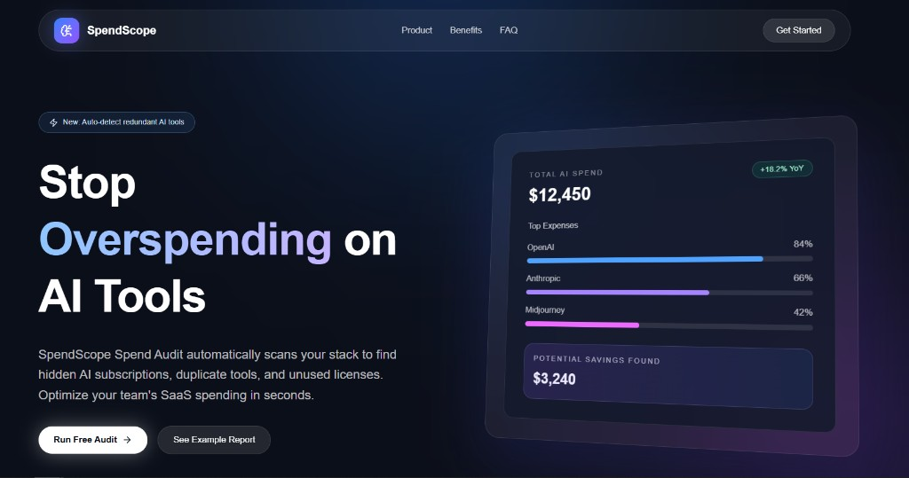

## Audit Form
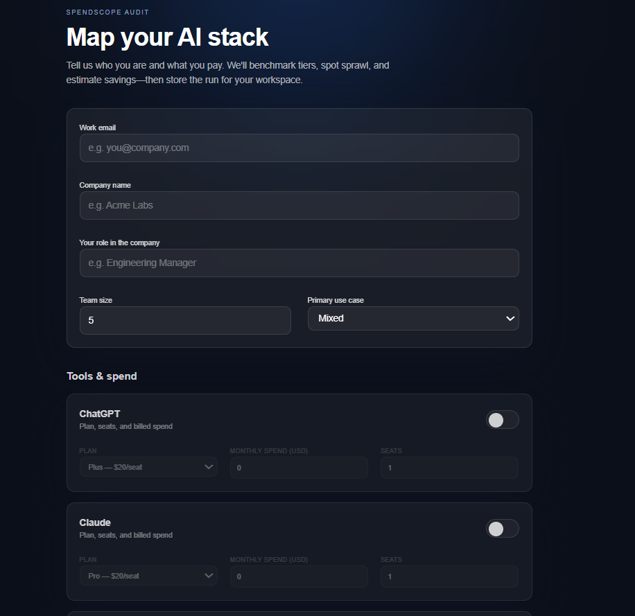

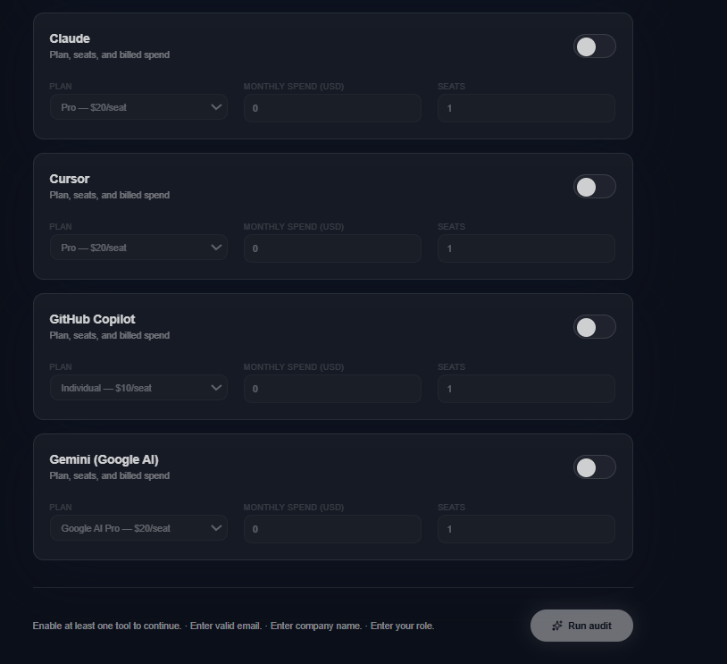

## Audit Results Page
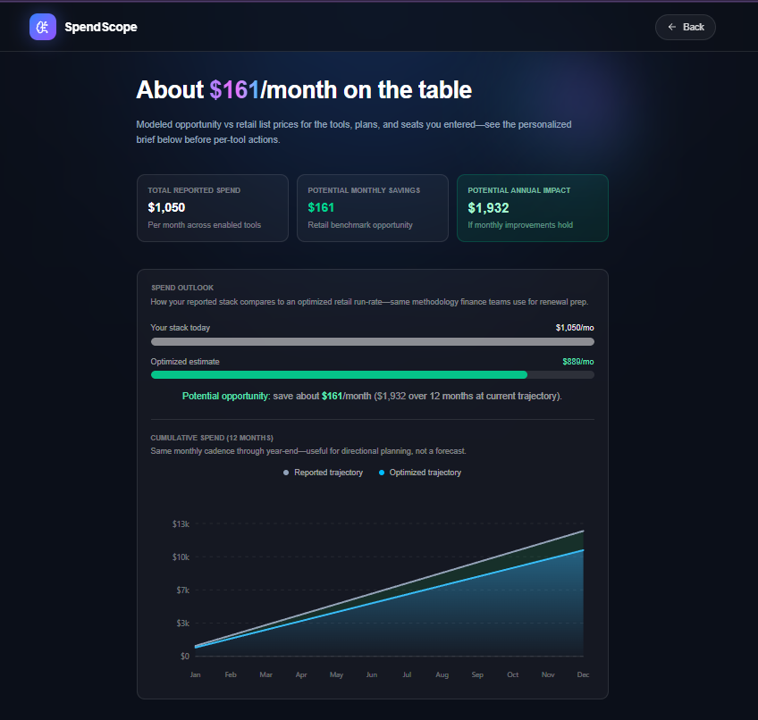

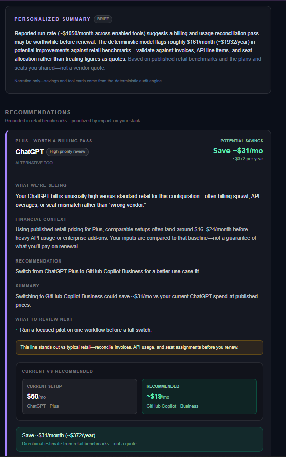

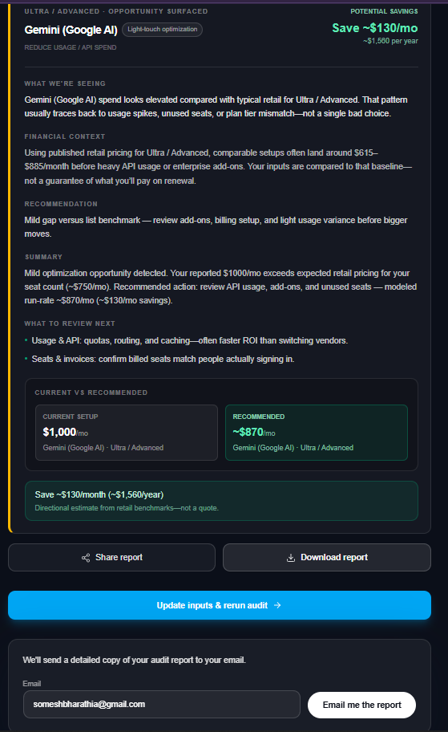

## Shareable Audit Report
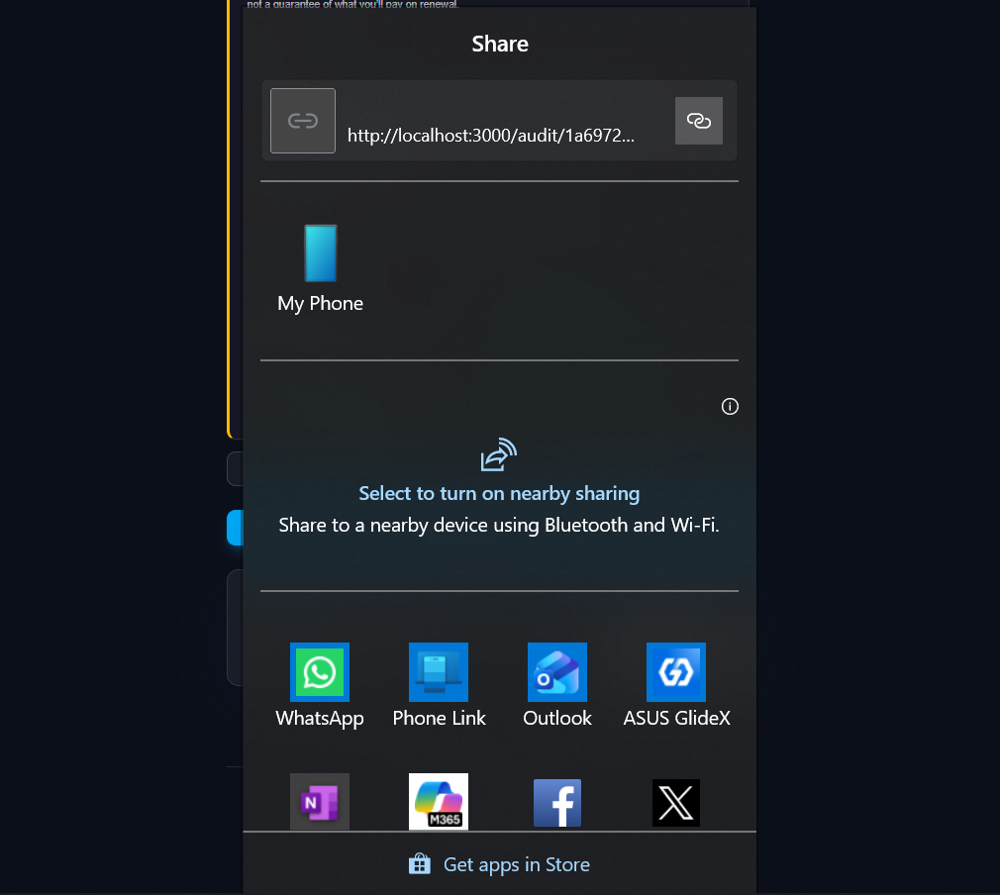

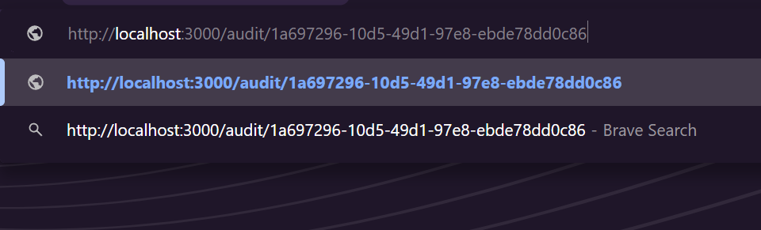

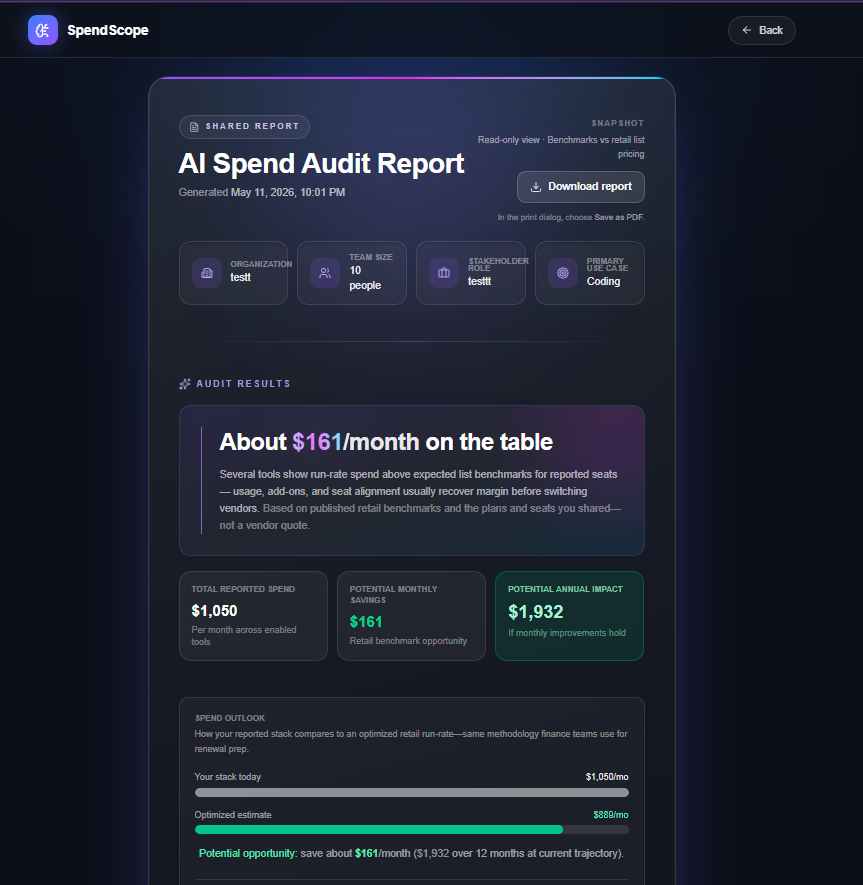

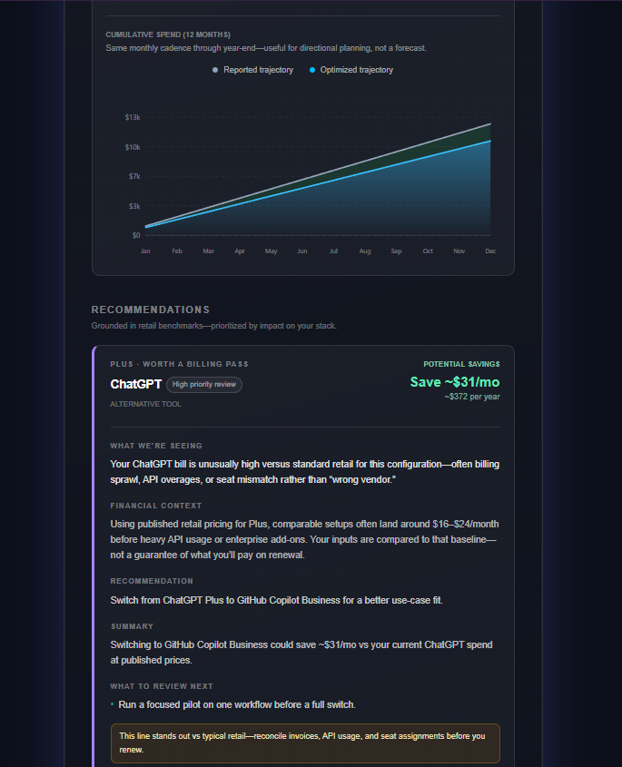

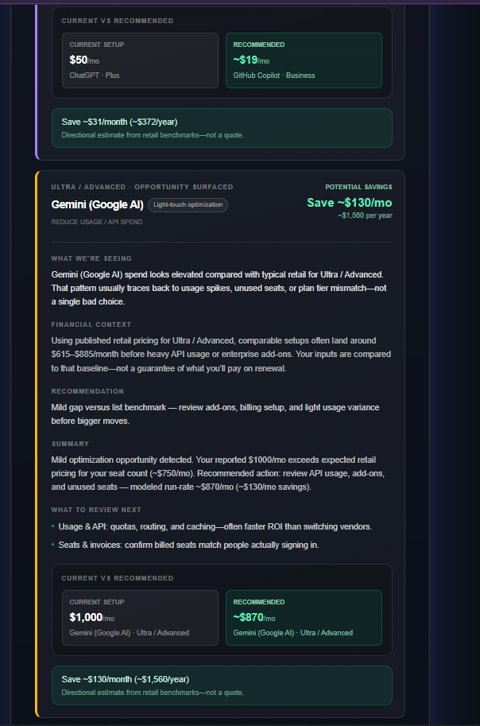

## Email Report
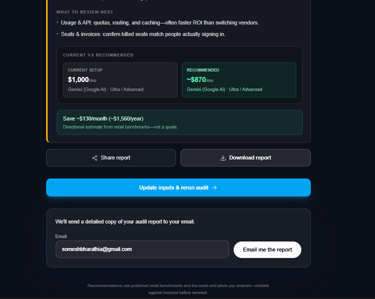

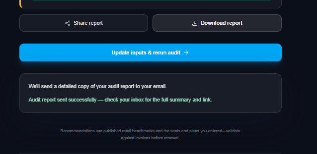

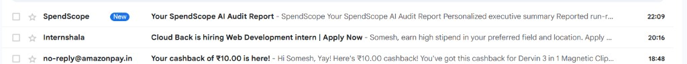

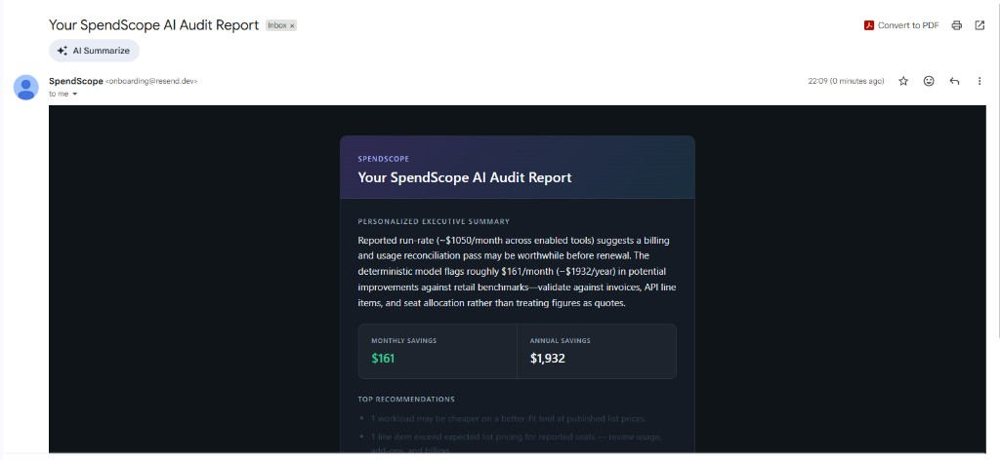

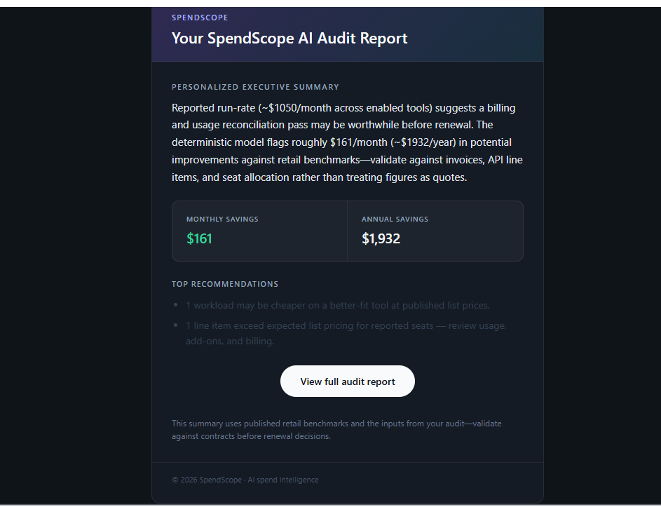

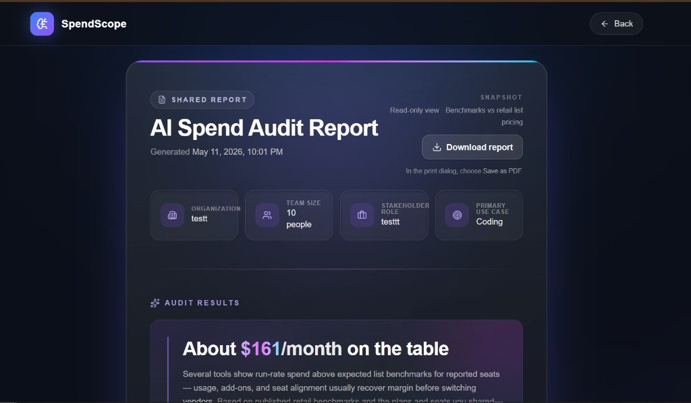

## Downloadable Report
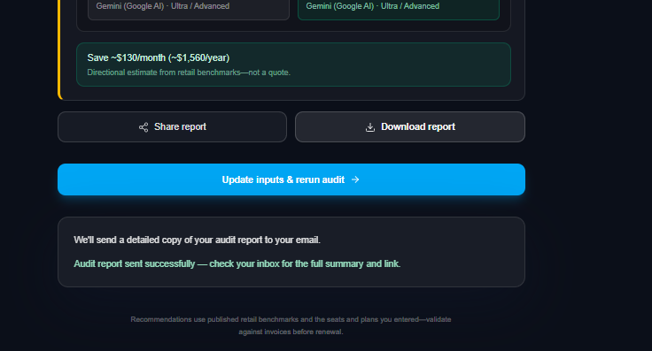

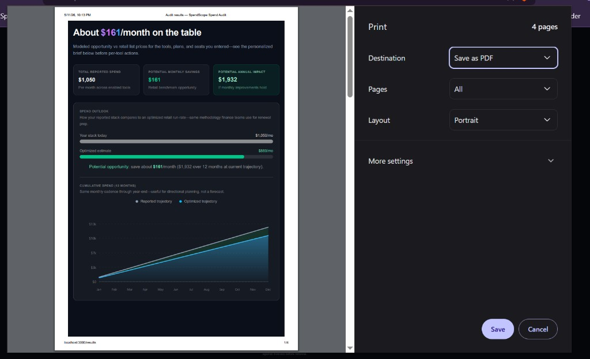

---

# Quick Start

## 1. Clone the repository

```bash
git clone https://github.com/your-username/SpendScope.git
cd SpendScope
```

## 2. Install dependencies

```bash
npm install
```

## 3. Configure environment variables

Create a `.env.local` file:

```env
NEXT_PUBLIC_SUPABASE_URL=
NEXT_PUBLIC_SUPABASE_PUBLISHABLE_KEY=
# Server-only (required for GET /api/detect-changes). Never use a NEXT_PUBLIC_ prefix.
SUPABASE_SERVICE_ROLE_KEY=

RESEND_API_KEY=
# Resend test mode: sends from onboarding@resend.dev (see lib/email/resend-from.ts).
# After domain verification, set RESEND_FROM_EMAIL=SpendScope <noreply@spendscope.site> on Vercel
# and flip USE_RESEND_TEST_SENDER to false in resend-from.ts.

# AI executive summary (optional — if unset, the API falls back to a deterministic paragraph)
GEMINI_API_KEY=

NEXT_PUBLIC_APP_URL=http://localhost:3000
```

## 4. Run locally

```bash
npm run dev
```

Visit:
```
http://localhost:3000
```

---

# Deployment

The application is deployed using Vercel.

To deploy:

```bash
vercel
```

Production environment variables should be configured inside the Vercel dashboard.

---

# Audit Engine Logic

The audit engine evaluates:

- Whether the current plan matches the user's seat count and declared spend
- If a cheaper plan exists from the same vendor
- If a better-value alternative tool exists
- If pricing significantly exceeds expected retail benchmarks
- Potential monthly and annual savings opportunities

Recommendations are benchmark-driven and designed to feel financially realistic rather than exaggerated.

---

## Supabase Security Considerations

For MVP simplicity, SpendScope currently uses unrestricted Supabase access for audit creation and retrieval through public share IDs.

The application avoids exposing sensitive information in public reports by stripping identifying details from shared audit views.

In a production deployment, the next step would be enabling stricter Row Level Security (RLS) policies, authenticated ownership checks, signed share tokens, and stronger rate limiting.

This tradeoff was intentionally made to prioritize rapid iteration and frictionless report sharing during the MVP stage.

---

# Shareable Reports

Each completed audit generates:
- a unique public report URL
- downloadable report support
- email-delivered summaries

Example:
```
/audit/[share_id]
```

---

# Decisions & Trade-offs

## 1. Used deterministic pricing logic instead of AI-generated recommendations
This keeps recommendations transparent, explainable, and financially defensible.

## 2. Chose Supabase over a custom backend
Supabase accelerated development speed while still supporting scalable storage and public sharing functionality.

## 3. Implemented shareable links instead of authentication
Authentication was intentionally skipped to keep the MVP frictionless and focused on audit delivery.

## 4. Used public pricing benchmarks instead of live API billing integrations
Direct billing integrations would significantly increase complexity and implementation time for the MVP.

## 5. Sent email summaries with share links instead of generating complex PDF exports initially
This simplified the email flow and improved development speed while still delivering a professional user experience.

---

# Future Improvements

- Live billing integrations
- AI-generated optimization explanations
- Team collaboration dashboards
- Historical audit tracking
- Smarter usage analytics
- Enterprise reporting workflows

---

# Author

Somesh Bharathi